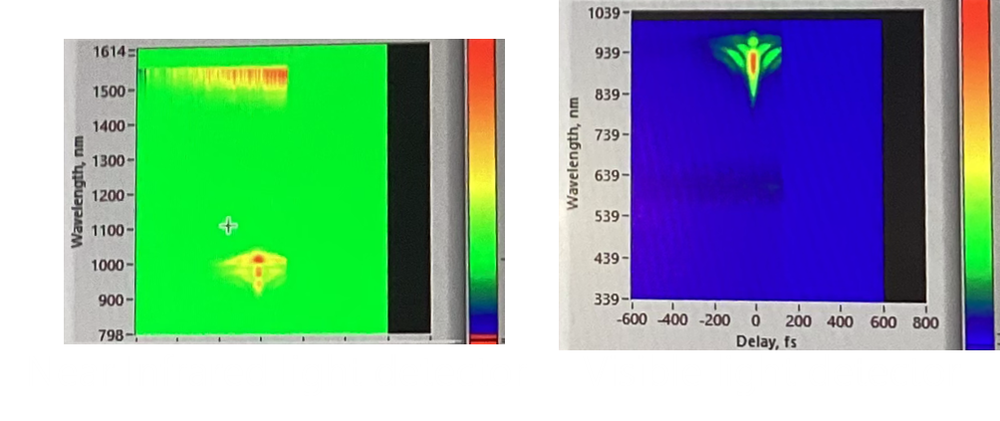
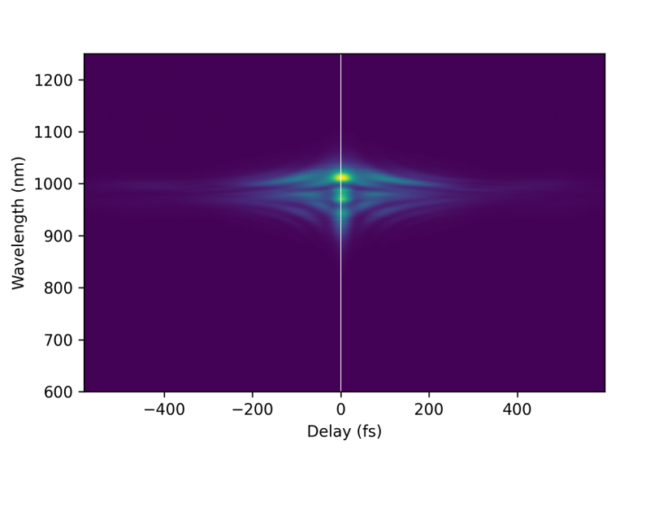
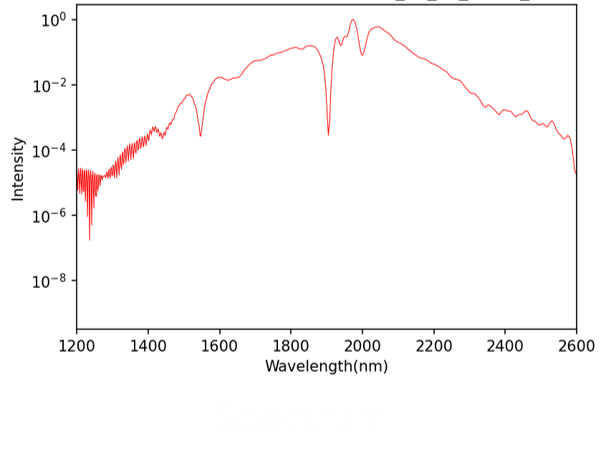
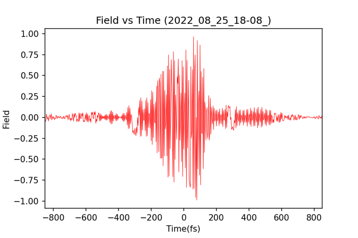
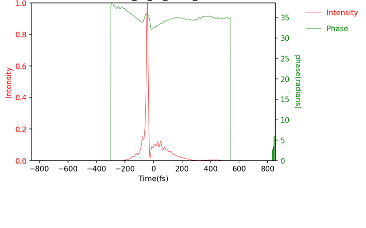

# frog

"frog"では，2つの分光器を用いたFROGシステムから得たデータをつなぎ合わせたり，FROGソフトウェアから得たデータを処理したりすることのできるプログラムです．

# DEMO

"frog"でできることについて以下に示します．

* 2つの分光器から得たデータをつなぎ合わせる．[stitch_traces](https://github.com/kaito0714/frog/blob/main/stitch_traces)

波長範囲が広すぎたため，1つの分光器では波長範囲を十分にカバーできなかったので2つの分光器を使用した．

1つは可視領域を，1つは赤外領域をカバーする分光器であった．

2つの分光器を用いたことで各分光器の強度の基準値が異なることや測定した波長範囲が重なることがあった．

そのため，強度をそろえて，つなぎ合わせる必要があった．

つなぎ合わせの結果を以下に示す．

**各分光器での測定結果（左：赤外領域，右：可視領域）**

**[つなぎ合わせたときの結果](https://github.com/kaito0714/frog/blob/main/stitch_traces)**

* FROGソフトウェアから得たデータを出力[frog_data_processing1](https://github.com/kaito0714/frog/blob/main/frog_data_processing_1)，[frog_data_processing_2](https://github.com/kaito0714/frog/blob/main/frog_data_processing_2)

次は，FROGソフトウェアで解析した光の特性をデータ処理して出力した結果を示す．

**[スペクトル（ログスケール）](https://github.com/kaito0714/frog/blob/main/frog_data_processing_1)**

**[時間領域における電場強度（規格化）](https://github.com/kaito0714/frog/blob/main/frog_data_processing_1)**

**[時間領域における強度と位相の関係](https://github.com/kaito0714/frog/blob/main/frog_data_processing_2)**

# Features

"frog"の特徴を以下に述べる．

* 分光器を2つ用いてもFROGソフトウェアを使用できる
* FROGソフトウェアから得たデータを視覚化できる
* 時間領域で電場の様子を確認できる

# Usage

* 2つの測定器から得たデータをつなぎ合わせたいときは[stitch_traces](https://github.com/kaito0714/frog/blob/main/stitch_traces)を使ってください．
* 時間領域での電場波形の様子やログスケールでのスペクトルが必要な時は[frog_data_processing1](https://github.com/kaito0714/frog/blob/main/frog_data_processing_1)を使ってください．
* 各波長における強度と位相の関係や時間領域における強度と位相の関係が必要な時は[frog_data_processing_2](https://github.com/kaito0714/frog/blob/main/frog_data_processing_2)を使ってください．

# Author

作成情報を列挙する

* 作成者：岡田海門
* 所属：豊田工業大学大学院　工学研究科　先端工学専攻　レーザ科学研究室
* E-mail：sd22405@tti-j.net
